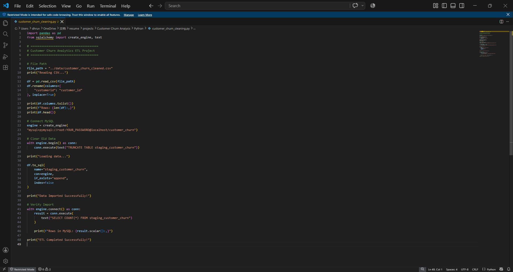
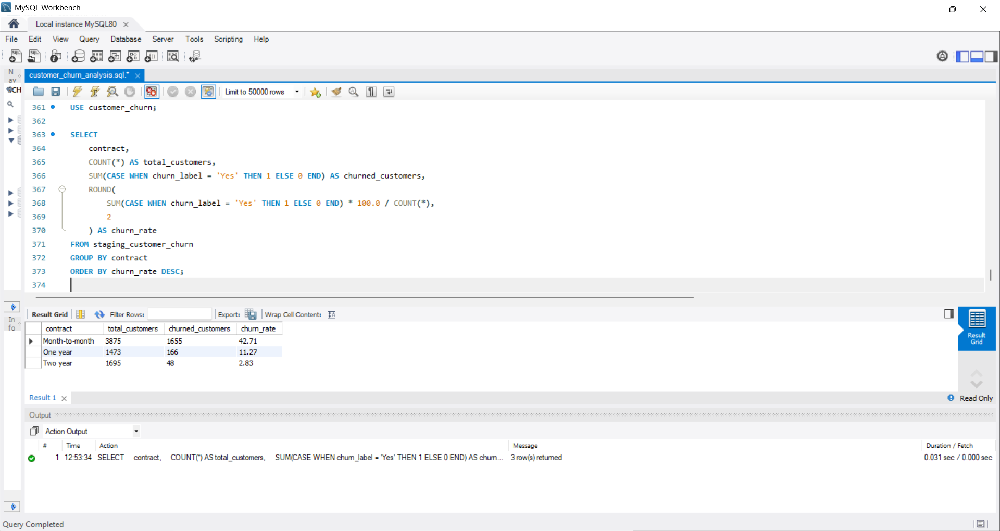
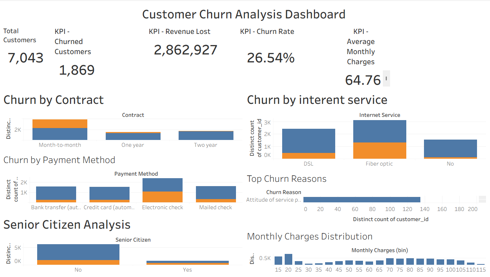

# Customer Churn Analysis

An end-to-end customer churn analysis project using Python, MySQL, SQL, and Tableau to clean customer data, perform business analysis, identify churn patterns, and build an interactive dashboard.

---

## 📌 Project Overview

Customer churn is an important business problem because losing existing customers can directly impact revenue and long-term growth.

This project analyzes customer churn data through an end-to-end data analytics workflow:

- Cleaned and transformed raw customer data using Python
- Built an ETL pipeline to load the processed data into MySQL
- Performed SQL-based business analysis
- Identified customer churn patterns and key churn drivers
- Built an interactive Tableau dashboard with KPIs and visualizations
- Developed business recommendations based on the analysis

---

## 🎯 Business Problem

The objective is to understand **why customers churn** and identify customer segments that are more likely to leave.

The analysis focuses on factors such as:

- Contract type
- Payment method
- Internet service
- Monthly charges
- Customer characteristics and service usage

Understanding these patterns can help businesses improve customer retention and reduce churn.

---

## 🎯 Project Objectives

- Clean and prepare customer churn data
- Build a structured ETL workflow
- Store processed data in MySQL
- Perform SQL-based exploratory and business analysis
- Identify major factors associated with customer churn
- Develop an interactive Tableau dashboard
- Generate actionable business recommendations

---

## 🛠️ Tools & Technologies

| Category | Tools |
|---|---|
| Programming | Python |
| Data Processing | Pandas |
| Database | MySQL |
| Data Analysis | SQL |
| Visualization | Tableau |
| Version Control | Git & GitHub |

---

## 📊 Dataset

The project uses customer-level churn data containing information related to:

- Customer demographics
- Contract information
- Payment methods
- Internet services
- Monthly charges
- Churn status

The dataset was cleaned and transformed before being used for SQL analysis and Tableau visualization.

---

## 🐍 Data Preparation with Python

Python was used as the first stage of the analytics workflow.

The data preparation process included:

- Loading the raw customer dataset
- Inspecting the dataset structure
- Identifying missing and inconsistent values
- Cleaning and transforming the data
- Preparing the processed dataset for database loading
- Creating an ETL workflow for MySQL

### Python Analysis



---

## 🗄️ MySQL & SQL Analysis

The cleaned data was loaded into MySQL for structured analysis.

SQL was used to:

- Analyze customer churn patterns
- Compare churn across customer segments
- Analyze contract types
- Analyze payment methods
- Analyze internet service categories
- Examine monthly charges
- Identify potential churn drivers

### SQL Analysis



---

## 📈 Tableau Dashboard

An interactive Tableau dashboard was developed to provide a visual overview of customer churn.

The dashboard includes:

- Churn-related KPIs
- Customer segmentation
- Churn analysis by contract type
- Churn analysis by payment method
- Churn analysis by internet service
- Monthly charge analysis
- Interactive visualizations for exploring churn patterns

### Dashboard Preview



---

## 📌 Key KPIs

The Tableau dashboard provides KPI-level analysis of customer churn, including:

- Total Customers
- Churned Customers
- Churn Rate
- Customer retention/churn distribution
- Monthly charge analysis

These KPIs provide a high-level view of the customer base and overall churn situation.

---

## 🔍 Key Insights

The analysis identified several important churn patterns:

### 1. Contract Type
Contract type is an important factor associated with customer churn. Customers on different contract types show different levels of churn behavior.

### 2. Payment Method
Churn patterns vary across payment methods, making payment behavior an important factor to investigate when identifying customers at risk of leaving.

### 3. Internet Service
Customers using different internet service categories demonstrate different churn patterns.

### 4. Monthly Charges
Monthly charges are associated with customer churn, making pricing and billing behavior important areas for retention analysis.

---

## 💡 Business Recommendations

Based on the analysis, businesses can consider:

- Targeting high-risk customers with retention campaigns
- Providing incentives for customers to move toward longer-term contracts
- Reviewing pricing and monthly charge structures
- Improving customer experience for high-churn service segments
- Investigating payment-related friction
- Using churn indicators to build proactive customer retention strategies

---

## 📂 Project Structure

```text
Customer-Churn-Analysis/
│
├── Data/
│   └── Customer churn dataset
│
├── Images/
│   ├── SQL_Query.png
│   ├── dashboard.png.png
│   ├── dataset.png
│   └── python_analysis.png
│
├── Python/
│   └── Data cleaning and analysis scripts
│
├── SQL/
│   └── SQL analysis queries
│
├── Tableau/
│   └── Tableau dashboard files
│
├── .gitignore
├── .gitattributes
├── LICENSE
├── README.md
└── requirements.txt
